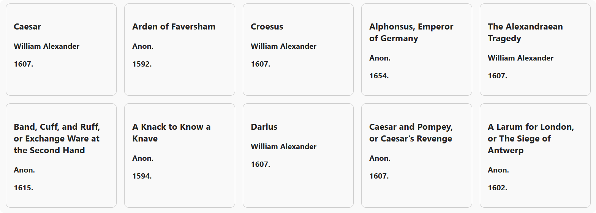

# Read Me

### Initialization

run `npm init -y` to create a package.json file

run `npm install express cors mongodb` to install dependencies

### Backend

cd `backend`

run `node server.js` to start the server  or `npm start`

run `Ctrl+C` to stop the server

### Frontend
install `Live Server` extension

click `Go Live` at bottom right

go to `frontend` in browser

### MongoDB

reads all drama text files from `mongodb/data` folder. These files will be processed by `ReadData.java` and then stored the data in MongoDB.

to run the module:

- `cd mongodb`
- run `mvn compile` and `mvn exec:java -Dexec.mainClass="Main"`

as of now, this module has successfully processed and stored 10 drama text files into MongoDB.



### sample queries

Title
```
Caesar / darius
```

Author
```
william / anon
```

Year
```
1607
```